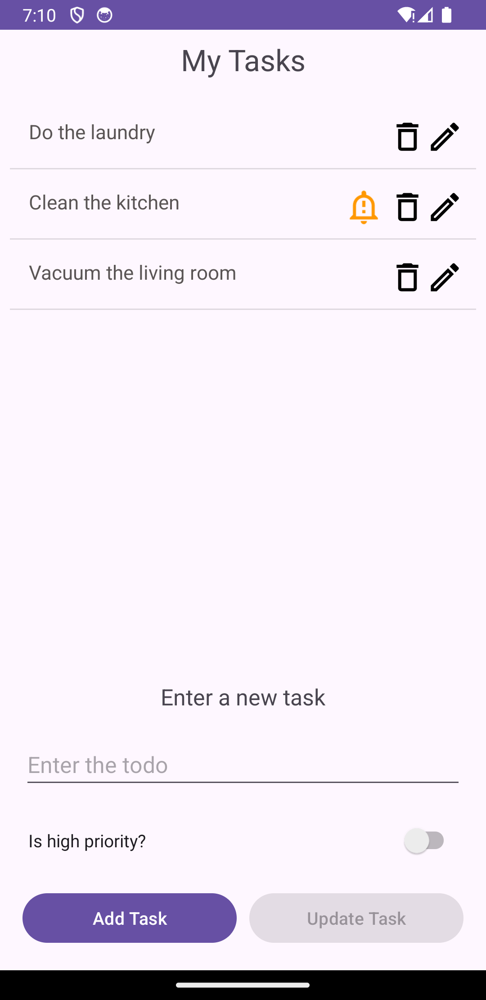
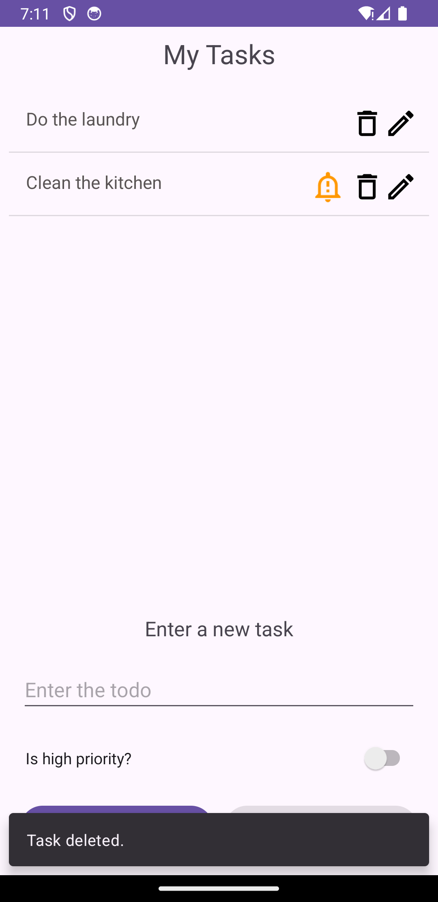
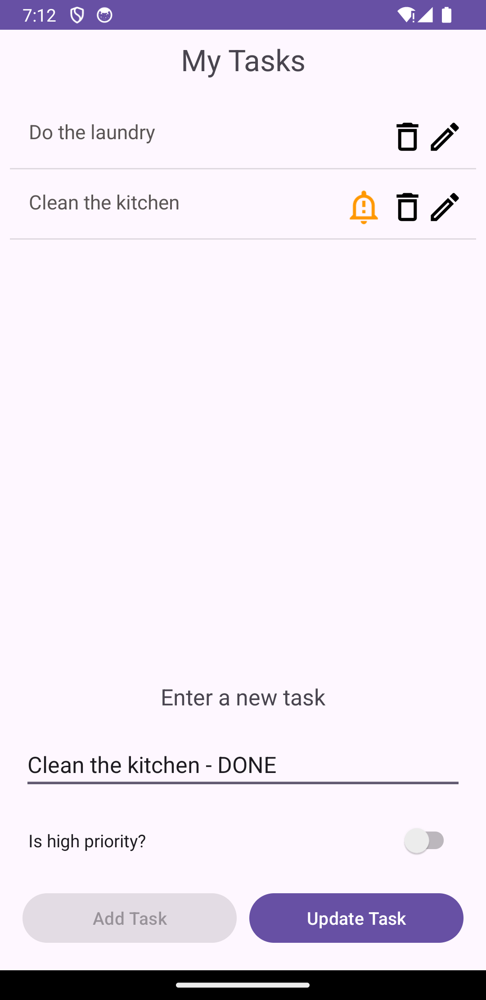
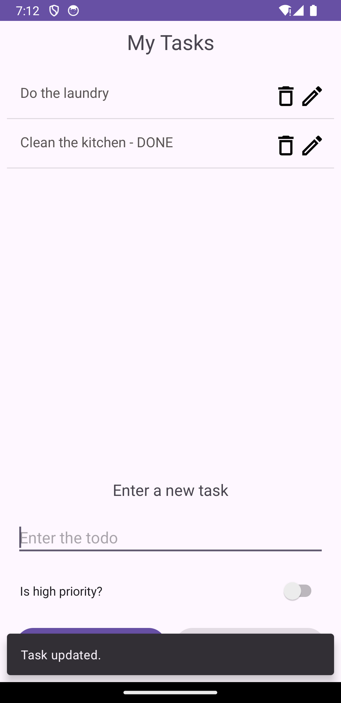
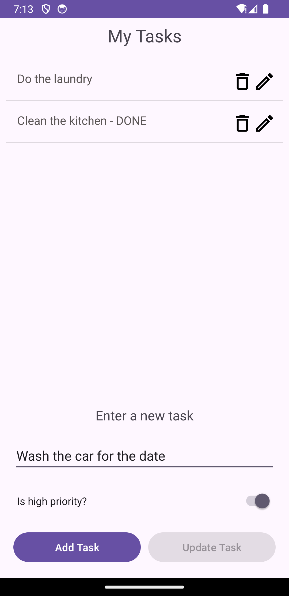
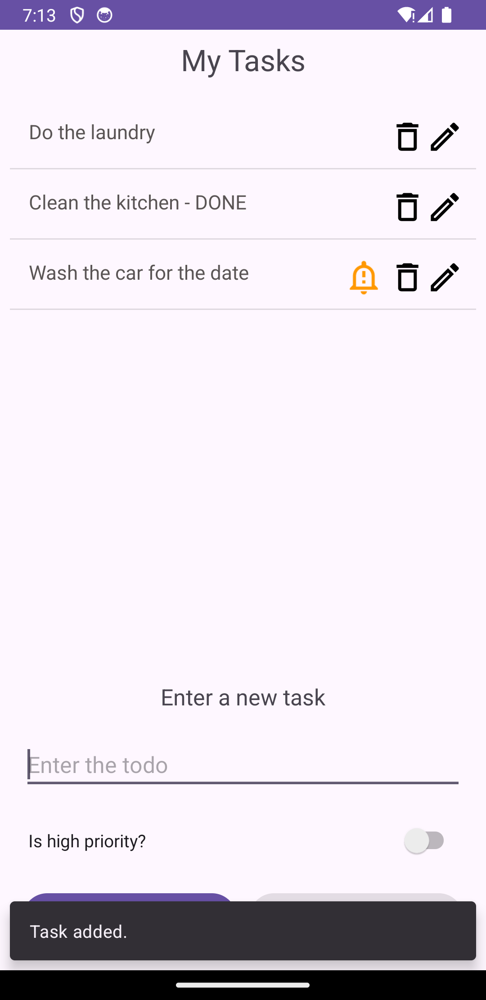

# ToDo App

<table>
  <tr>
    <td></td>
    <td></td>
  </tr>
</table>

## Descripción

Esta aplicación de Android, desarrollada con XML y Kotlin, implementa un adaptador de RecyclerView con un diseño personalizado para las filas. La aplicación permite a los usuarios añadir, actualizar y eliminar tareas, así como marcarlas y desmarcarlas como importantes. Se utilizan interfaces para manejar estas interacciones de manera limpia, asegurando una base de código modular y mantenible. Además, la aplicación implementa SnackBars, proporcionando retroalimentación rápida al usuario. Este proyecto muestra prácticas modernas de desarrollo en Android, incluyendo diseños personalizados, adaptadores de RecyclerView, manejo de eventos basado en interfaces y notificaciones amigables para el usuario con SnackBars.

## Características

- **Kotlin**: Utilizado para desarrollar la lógica de la aplicación.
- **XML**: Utilizado para diseñar la interfaz de usuario.
- **Binding**: Para un acceso eficiente y seguro a los componentes de la interfaz de usuario.
- **OOP**: Demuestra los principios de programación orientada a objetos.
- **RecyclerView Adapter**: Para gestionar y mostrar eficientemente una lista de elementos de datos en un RecyclerView.
- **Custom Layout**: Para diseñar una fila personalizada específicamente para el adaptador.
- **Interface**: Para manejar las interacciones del usuario y proporcionar una separación clara de responsabilidades.
- **Snackbar**: Para proporciona retroalimentación rápida a los usuarios activada mediante eventos de click.

## Configuración Necesaria

- No se requiere configuración adicional.

## Demostración

A continuación, algunas capturas de pantalla de la aplicación:

<table>
  <tr>
    <td></td>
    <td></td>
  </tr>
  <tr>
    <td></td>
    <td></td>
  </tr>
  <tr>
    <td></td>
    <td></td>
  </tr>
</table>

## License 

The MIT License (MIT)

- **Copyright (c) 2024 Jonathan Reátegui**

Permission is hereby granted, free of charge, to any person obtaining a copy of this software and associated documentation files (the "Software"), to deal in the Software without restriction, including without limitation the rights to use, copy, modify, merge, publish, distribute, sublicense, and/or sell copies of the Software, and to permit persons to whom the Software is furnished to do so, subject to the following conditions:

The above copyright notice and this permission notice shall be included in all copies or substantial portions of the Software.

THE SOFTWARE IS PROVIDED "AS IS", WITHOUT WARRANTY OF ANY KIND, EXPRESS OR IMPLIED, INCLUDING BUT NOT LIMITED TO THE WARRANTIES OF MERCHANTABILITY, FITNESS FOR A PARTICULAR PURPOSE AND NONINFRINGEMENT. IN NO EVENT SHALL THE AUTHORS OR COPYRIGHT HOLDERS BE LIABLE FOR ANY CLAIM, DAMAGES OR OTHER LIABILITY, WHETHER IN AN ACTION OF CONTRACT, TORT OR OTHERWISE, ARISING FROM, OUT OF OR IN CONNECTION WITH THE SOFTWARE OR THE USE OR OTHER DEALINGS IN THE SOFTWARE.
